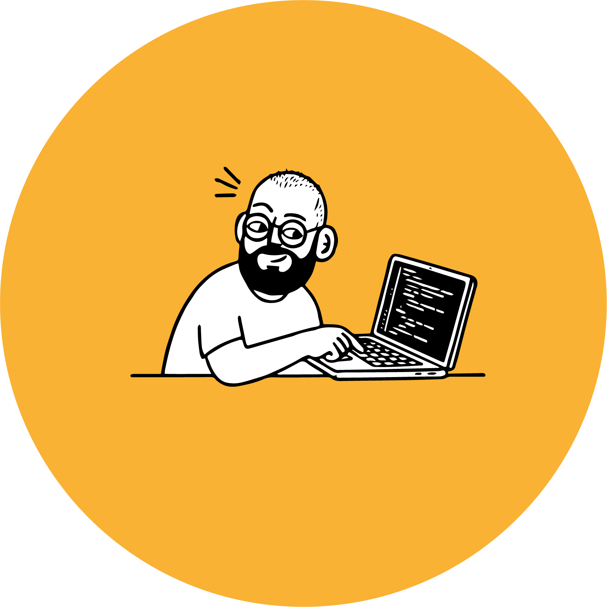

  

###

  
  
  

###

<h1 align="center">Ciao 👋</h1>

###

<h3 align="left">👩‍💻  Soy desarrollador web junior y diseñador gráfico. Apasionado por el diseño y siempre en constante aprendizaje dentro del desarrollo web.</h3>

###

Cuento con varios años de experiencia como diseñador gráfico y fotógrafo, áreas en las que he desarrollado una sólida base creativa y técnica. Paralelamente, me apasiona el mundo del desarrollo web, motivo por el cual he completado un Grado Superior en Desarrollo de Aplicaciones Web, ampliando mis competencias en el ámbito digital.

###

<h3 align="left">🛠 Languajes y herramientas</h3>

###

  
  
  
  
  
  
  
  
  
  
  
  
  
  
  
  
  
  
  
  
  
  
  

###

<h3 align="left"></h3>

###
